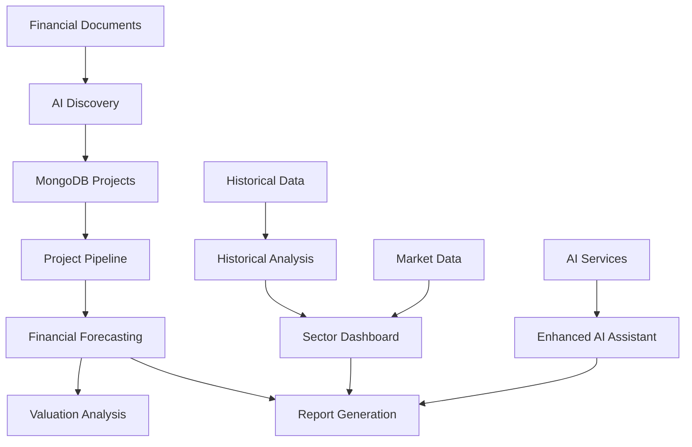

# 🏗️ Real Estate Financial Model - Architecture Documentation

## 📋 Table of Contents

1. [System Overview](#system-overview)
2. [Architecture Patterns](#architecture-patterns)
3. [Component Architecture](#component-architecture)
4. [Data Architecture](#data-architecture)
5. [AI Integration Architecture](#ai-integration-architecture)
6. [API Design](#api-design)
7. [Security Architecture](#security-architecture)
8. [Performance Architecture](#performance-architecture)
9. [Deployment Architecture](#deployment-architecture)
10. [Future Architecture Roadmap](#future-architecture-roadmap)

## 🎯 System Overview

The Real Estate Financial Model is a sophisticated, AI-powered financial analysis platform built on a modular, event-driven architecture. It combines traditional financial modeling with cutting-edge AI capabilities to provide institutional-grade analysis tools for Vietnamese real estate companies.

### **Core Design Principles**

- **Modularity**: Independent, loosely-coupled components
- **Extensibility**: Easy addition of new features and data sources
- **AI-First**: AI services integrated throughout the platform
- **Data-Driven**: Comprehensive data integration and processing
- **User-Centric**: Intuitive interfaces with powerful backend capabilities

## 🏛️ Architecture Patterns

### **1. Layered Architecture**

```
┌─────────────────────────────────────────────────────────────┐
│                    Presentation Layer                        │
│  ┌─────────────┐  ┌─────────────┐  ┌─────────────┐         │
│  │   Streamlit │  │   Plotly    │  │   AgGrid    │         │
│  │     UI      │  │  Charts     │  │   Tables    │         │
│  └─────────────┘  └─────────────┘  └─────────────┘         │
└─────────────────────────────────────────────────────────────┘
                              │
┌─────────────────────────────────────────────────────────────┐
│                    Application Layer                        │
│  ┌─────────────┐  ┌─────────────┐  ┌─────────────┐         │
│  │    Tabs     │  │   Utils     │  │    Core     │         │
│  │  (Features) │  │ (Services)  │  │  (Logic)    │         │
│  └─────────────┘  └─────────────┘  └─────────────┘         │
└─────────────────────────────────────────────────────────────┘
                              │
┌─────────────────────────────────────────────────────────────┐
│                      Data Layer                             │
│  ┌─────────────┐  ┌─────────────┐  ┌─────────────┐         │
│  │   MongoDB   │  │   Parquet   │  │    CSV      │         │
│  │ (Dynamic)   │  │ (Historical)│  │ (Market)    │         │
│  └─────────────┘  └─────────────┘  └─────────────┘         │
└─────────────────────────────────────────────────────────────┘
```

### **2. Model-View-Controller (MVC) Pattern**

- **Model**: Data access layer (`utils/mongodb_utils.py`, data files)
- **View**: Streamlit UI components (`tabs/`, `pages/`)
- **Controller**: Business logic (`core/`, `utils/`)

### **3. Tool Registry Pattern**

The AI Tool System implements a dynamic tool registry pattern:

```python
class EnhancedAIToolSystem:
    def __init__(self):
        self.tools = {}
        self.tool_schemas = {}
    
    def tool(self, name, description, parameters):
        def decorator(func):
            self.tools[name] = func
            self.tool_schemas[name] = {
                "name": name,
                "description": description,
                "parameters": parameters
            }
            return func
        return decorator
```

### **4. Factory Pattern**

Used for creating different types of charts and visualizations:

```python
class ChartFactory:
    @staticmethod
    def create_chart(chart_type, data, config):
        if chart_type == "line":
            return LineChart(data, config)
        elif chart_type == "scatter":
            return ScatterChart(data, config)
        # ... other chart types
```

## 🧩 Component Architecture

### **Frontend Components**

#### **1. Main Application (`pages/Real_Estate_Financial_Model_God_AI.py`)**
- **Purpose**: Application entry point and navigation
- **Responsibilities**: 
  - Session state management
  - Sidebar navigation
  - Tab orchestration
  - User authentication

#### **2. Feature Tabs (`tabs/`)**

| Tab | Purpose | Key Components |
|-----|---------|----------------|
| `ai_discovery.py` | AI-powered project extraction | Claude AI, Perplexity, PDF processing |
| `assumptions.py` | Model assumptions management | MongoDB integration, validation |
| `enhanced_ai_assistant.py` | AI analysis tools | Tool system, MCP framework |
| `historical_analysis.py` | Historical data analysis | Data loading, trend analysis |
| `model_forecast.py` | Financial forecasting | Revenue modeling, P&L/BS/CF |
| `project_pipeline_real_estate.py` | Project management | Gantt charts, IRR calculations |
| `ReportGeneration.py` | Report generation | Template system, PDF export |
| `sector_dashboard.py` | Peer analysis | Comparable tables, sector charts |
| `Valuation.py` | Valuation analysis | RNAV calculations, DCF |

### **Backend Components**

#### **1. Utility Layer (`utils/`)**

```
utils/
├── AI/                           # AI tool implementations
│   ├── AI_financial_forecast_tools.py
│   ├── AI_market_data_tools.py
│   ├── AI_real_estate_project_tools.py
│   └── AI_visualisation_tool.py
├── mongodb_utils.py              # Database operations
├── perplexity_utils.py           # Perplexity AI integration
├── chatgpt_utils.py              # OpenAI integration
├── project_pipeline_manager.py   # Project orchestration
└── [other utility modules]
```

#### **2. Core Logic (`core/`)**

```
core/
├── common_imports.py             # Shared imports
├── data_loader.py                # Data loading utilities
└── plot_factory.py               # Chart generation
```

#### **3. Configuration (`config/`)**

```
config/
└── constants.py                  # Application constants
```

## 📊 Data Architecture

### **Data Sources**

| Source | Type | Purpose | Update Frequency |
|--------|------|---------|------------------|
| `FA_A_processed.parquet` | Historical | Annual financial statements | Quarterly |
| `FA_processed.parquet` | Historical | Quarterly financial statements | Monthly |
| `Val_processed.csv` | Market | P/E, P/B ratios | Daily |
| `MongoDB Companies` | Dynamic | Company metadata | As needed |
| `MongoDB RealEstateProjects` | Dynamic | Project details | As needed |
| `MongoDB CompanyForecast` | Dynamic | Forecast data | As needed |

### **Data Flow Architecture**



### **Data Processing Pipeline**

1. **Data Ingestion**: Multiple sources (CSV, Parquet, MongoDB, APIs)
2. **Data Validation**: Type checking, range validation, consistency checks
3. **Data Transformation**: Normalization, aggregation, calculation
4. **Data Storage**: MongoDB for dynamic data, files for static data
5. **Data Retrieval**: Cached queries, optimized access patterns

## 🤖 AI Integration Architecture

### **AI Service Integration**

```python
class AIOrchestrator:
    def __init__(self):
        self.claude_client = anthropic.Anthropic(api_key=CLAUDE_API_KEY)
        self.openai_client = openai.OpenAI(api_key=OPENAI_API_KEY)
        self.perplexity_client = PerplexityClient(api_key=PERPLEXITY_API_KEY)
    
    def process_document(self, document, task_type):
        if task_type == "project_extraction":
            return self.claude_client.extract_projects(document)
        elif task_type == "market_research":
            return self.perplexity_client.research(document)
        # ... other AI tasks
```

### **Tool System Architecture**

The Enhanced AI Tool System implements a comprehensive tool registry:

```python
class EnhancedAIToolSystem:
    def __init__(self):
        self.tools = {}
        self.tool_schemas = {}
        self.vietnam_stocks_db = None
    
    def register_tool(self, name, func, schema):
        self.tools[name] = func
        self.tool_schemas[name] = schema
    
    def execute_tool(self, tool_name, parameters):
        if tool_name in self.tools:
            return self.tools[tool_name](**parameters)
        else:
            return {"error": f"Tool {tool_name} not found"}
```

### **AI Tool Categories**

#### **1. Financial Analysis Tools**
- `get_historical_financials`: Historical data retrieval
- `get_financial_forecasts`: Forecast data access
- `calculate_balance_sheet_ratios`: Ratio calculations
- `get_valuation_analysis`: Valuation metrics

#### **2. Project Analysis Tools**
- `search_projects`: Project discovery
- `get_project_details`: Project information
- `get_project_metrics`: Time series analysis
- `rank_projects_by_metric`: Project ranking

#### **3. Market Data Tools**
- `get_market_data`: Market metrics
- `get_consensus_estimates`: Analyst estimates
- `get_news_sentiment`: Sentiment analysis

#### **4. Visualization Tools**
- `render_chart`: Chart generation
- `create_dashboard`: Dashboard creation
- `export_visualization`: Export capabilities

## 🔌 API Design

### **Internal API Structure**

#### **1. Data Access APIs**

```python
# MongoDB Operations
def load_companies_data() -> pd.DataFrame
def load_projects_data() -> pd.DataFrame
def load_company_forecast(ticker: str) -> Dict
def save_project_to_mongodb(project_data: Dict) -> bool

# File Operations
def load_historical_data(ticker: str) -> pd.DataFrame
def load_market_data() -> pd.DataFrame
```

#### **2. AI Service APIs**

```python
# Claude AI Integration
def extract_projects_from_document(document: bytes) -> List[Dict]
def analyze_financial_statement(text: str) -> Dict

# Perplexity Integration
def research_project_details(project_name: str) -> Dict
def get_market_sentiment(ticker: str) -> Dict

# OpenAI Integration
def generate_financial_insights(data: Dict) -> str
def create_investment_thesis(analysis: Dict) -> str
```

#### **3. Business Logic APIs**

```python
# Financial Modeling
def calculate_revenue_forecast(assumptions: Dict) -> Dict
def generate_balance_sheet(forecast: Dict) -> Dict
def calculate_rnav(project_data: List[Dict]) -> float

# Analysis
def perform_sector_analysis(tickers: List[str]) -> Dict
def calculate_valuation_metrics(company_data: Dict) -> Dict
```

### **Error Handling Architecture**

```python
class APIError(Exception):
    def __init__(self, message: str, error_code: str, details: Dict = None):
        self.message = message
        self.error_code = error_code
        self.details = details or {}

class DataNotFoundError(APIError):
    pass

class ValidationError(APIError):
    pass

class AIServiceError(APIError):
    pass
```

## 🔒 Security Architecture

### **Authentication & Authorization**

```python
class SecurityManager:
    def __init__(self):
        self.api_keys = self._load_api_keys()
        self.user_sessions = {}
    
    def _load_api_keys(self):
        return {
            'openai': os.getenv('OPENAI_API_KEY'),
            'anthropic': os.getenv('ANTHROPIC_API_KEY'),
            'perplexity': os.getenv('PERPLEXITY_API_KEY'),
            'mongodb': os.getenv('MONGODB_CONNECTION_STRING')
        }
    
    def validate_api_key(self, service: str, key: str) -> bool:
        return self.api_keys.get(service) == key
```

### **Data Security**

1. **API Key Management**: Environment variables, secure storage
2. **Data Encryption**: At rest and in transit
3. **Access Control**: Session-based user management
4. **Audit Logging**: Comprehensive operation tracking

### **Input Validation**

```python
class DataValidator:
    @staticmethod
    def validate_ticker(ticker: str) -> bool:
        return ticker.isalpha() and len(ticker) <= 10
    
    @staticmethod
    def validate_year(year: int) -> bool:
        return 2000 <= year <= 2030
    
    @staticmethod
    def validate_financial_data(data: Dict) -> bool:
        required_fields = ['revenue', 'net_income', 'total_assets']
        return all(field in data for field in required_fields)
```

## ⚡ Performance Architecture

### **Caching Strategy**

```python
class CacheManager:
    def __init__(self):
        self.memory_cache = {}
        self.cache_ttl = 600  # 10 minutes
    
    @st.cache_data(ttl=600)
    def get_historical_data(self, ticker: str) -> pd.DataFrame:
        # Cached data retrieval
        pass
    
    @st.cache_data(ttl=3600)
    def get_market_data(self) -> pd.DataFrame:
        # Cached market data
        pass
```

### **Performance Optimizations**

1. **Lazy Loading**: Load data only when needed
2. **Data Caching**: Intelligent caching with TTL
3. **Async Operations**: Non-blocking AI service calls
4. **Memory Management**: Efficient data processing
5. **Query Optimization**: MongoDB index optimization

### **Resource Management**

```python
class ResourceManager:
    def __init__(self):
        self.active_connections = {}
        self.memory_usage = 0
        self.max_memory = 8 * 1024 * 1024 * 1024  # 8GB
    
    def cleanup_resources(self):
        # Clean up unused connections
        # Free memory
        # Close file handles
        pass
```

## 🚀 Deployment Architecture

### **Current Deployment**

```
┌─────────────────────────────────────────────────────────────┐
│                    Local Development                        │
│  ┌─────────────┐  ┌─────────────┐  ┌─────────────┐         │
│  │   Streamlit │  │   MongoDB   │  │   AI APIs   │         │
│  │   (Local)   │  │  (Cloud)    │  │  (Cloud)    │         │
│  └─────────────┘  └─────────────┘  └─────────────┘         │
└─────────────────────────────────────────────────────────────┘
```

### **Production Deployment (Planned)**

```
┌─────────────────────────────────────────────────────────────┐
│                    Cloud Infrastructure                      │
│  ┌─────────────┐  ┌─────────────┐  ┌─────────────┐         │
│  │   Docker    │  │   MongoDB   │  │   AI APIs   │         │
│  │  Container  │  │  (Atlas)    │  │  (Cloud)    │         │
│  └─────────────┘  └─────────────┘  └─────────────┘         │
│  ┌─────────────┐  ┌─────────────┐  ┌─────────────┐         │
│  │   Redis     │  │   S3        │  │   CDN       │         │
│  │  (Cache)    │  │ (Storage)   │  │ (Static)    │         │
│  └─────────────┘  └─────────────┘  └─────────────┘         │
└─────────────────────────────────────────────────────────────┘
```

### **Environment Configuration**

```python
class EnvironmentConfig:
    def __init__(self, environment: str):
        self.environment = environment
        self.config = self._load_config()
    
    def _load_config(self):
        if self.environment == "development":
            return {
                "debug": True,
                "cache_ttl": 60,
                "log_level": "DEBUG"
            }
        elif self.environment == "production":
            return {
                "debug": False,
                "cache_ttl": 3600,
                "log_level": "INFO"
            }
```

## 🔮 Future Architecture Roadmap

### **Phase 1: MCP Enhancement (Current)**

- **Tool System**: Enhanced AI tool registry
- **Data Integration**: Comprehensive data sources
- **AI Orchestration**: Multi-LLM coordination

### **Phase 2: Microservices Architecture**

```python
# Planned microservices
class ValuationService:
    def calculate_dcf(self, data: Dict) -> Dict
    def calculate_comparable_valuation(self, data: Dict) -> Dict

class ProjectAnalysisService:
    def analyze_project_pipeline(self, data: Dict) -> Dict
    def calculate_rnav(self, data: Dict) -> Dict

class MarketDataService:
    def get_real_time_data(self, tickers: List[str]) -> Dict
    def get_consensus_estimates(self, ticker: str) -> Dict
```

### **Phase 3: Event-Driven Architecture**

```python
class EventBus:
    def __init__(self):
        self.subscribers = {}
    
    def subscribe(self, event_type: str, handler: callable):
        if event_type not in self.subscribers:
            self.subscribers[event_type] = []
        self.subscribers[event_type].append(handler)
    
    def publish(self, event_type: str, data: Dict):
        if event_type in self.subscribers:
            for handler in self.subscribers[event_type]:
                handler(data)
```

### **Phase 4: Advanced AI Integration**

- **Multi-Agent Systems**: Coordinated AI agents
- **Automated Workflows**: End-to-end research automation
- **Real-time Processing**: Streaming data analysis
- **Advanced Analytics**: ML-powered insights

## 📈 Scalability Considerations

### **Horizontal Scaling**

1. **Load Balancing**: Distribute requests across instances
2. **Database Sharding**: Partition data by company/ticker
3. **Caching Layer**: Redis for distributed caching
4. **CDN**: Static asset delivery

### **Vertical Scaling**

1. **Memory Optimization**: Efficient data structures
2. **CPU Optimization**: Parallel processing
3. **Storage Optimization**: Data compression
4. **Network Optimization**: Connection pooling

## 🔧 Monitoring & Observability

### **Logging Architecture**

```python
import logging

class Logger:
    def __init__(self, name: str):
        self.logger = logging.getLogger(name)
        self.setup_logging()
    
    def setup_logging(self):
        handler = logging.StreamHandler()
        formatter = logging.Formatter(
            '%(asctime)s - %(name)s - %(levelname)s - %(message)s'
        )
        handler.setFormatter(formatter)
        self.logger.addHandler(handler)
```

### **Metrics Collection**

1. **Performance Metrics**: Response times, throughput
2. **Business Metrics**: User actions, data processing
3. **Error Metrics**: Error rates, failure patterns
4. **Resource Metrics**: CPU, memory, storage usage

## 🎯 Conclusion

The Real Estate Financial Model architecture is designed for:

- **Scalability**: Modular, extensible design
- **Maintainability**: Clear separation of concerns
- **Performance**: Optimized data processing and caching
- **Security**: Comprehensive security measures
- **AI Integration**: Seamless AI service integration
- **Future-Proofing**: Architecture ready for enhancement

This architecture provides a solid foundation for a sophisticated financial analysis platform while maintaining flexibility for future enhancements and scaling requirements.

---

**Architecture Version**: 1.0  
**Last Updated**: December 2024  
**Maintainer**: Dragon Capital Development Team
