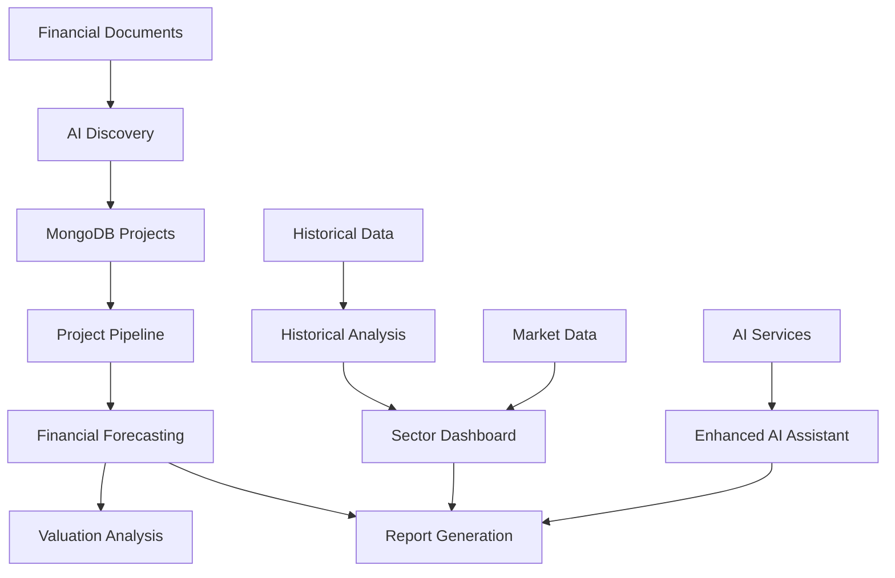

# 🏢 Real Estate Financial Model - God AI Edition

A comprehensive, AI-powered financial modeling platform designed specifically for Vietnamese real estate companies. Built for Dragon Capital's investment analysis workflows, this platform combines traditional financial modeling with cutting-edge AI capabilities to provide institutional-grade analysis tools.

## 🚀 Quick Start

```bash
# Install dependencies
pip install -r requirements.txt

# Set up environment variables (create .env file)
MONGODB_CONNECTION_STRING="your_mongodb_connection"
OPENAI_API_KEY="your_openai_key"
ANTHROPIC_API_KEY="your_anthropic_key"
PERPLEXITY_API_KEY="your_perplexity_key"

# Run the application
streamlit run pages/Real_Estate_Financial_Model_God_AI.py
```

## 🎯 Core Features

### 📊 **Historical Financial Analysis**
- **Multi-period Analysis**: Annual and quarterly financial statement analysis
- **Trend Analysis**: YoY, QoQ, TTM, and CAGR calculations
- **Interactive Visualizations**: Dynamic charts and graphs with Plotly
- **Data Sources**: FA_A_processed.parquet (annual), FA_processed.parquet (quarterly)

### 🤖 **AI-Powered Project Discovery**
- **Document Processing**: Extract real estate projects from PDF/Excel financial statements
- **Claude AI Integration**: Intelligent project identification and data extraction
- **Perplexity Research**: Market data enrichment and project validation
- **MongoDB Storage**: Persistent project database with version control

### 📈 **Advanced Financial Modeling**
- **Revenue Forecasting**: Three-stream revenue model (Presales, Handover, Recurring)
- **Project Pipeline Management**: Gantt charts and timeline visualization
- **Complete Financial Statements**: P&L, Balance Sheet, and Cash Flow projections
- **Sensitivity Analysis**: Scenario modeling and assumption testing

### 🏗️ **Project-Level Analysis**
- **RNAV Calculations**: Sum-of-the-parts valuation methodology
- **Project IRR**: Individual project return analysis
- **Cash Flow Modeling**: Detailed project cash flow projections
- **Land Bank Analysis**: Total land holdings and development pipeline

### 📊 **Sector Dashboard & Peer Analysis**
- **Comparable Analysis**: Multi-company financial metrics comparison
- **Dynamic Metrics**: Revenue, NPATMI, Balance Sheet metrics, and ratios
- **YoY Growth Analysis**: Absolute values and year-over-year growth calculations
- **Sector Charts**: Trailing P/E and P/B analysis with averages and medians
- **Scatter Analysis**: P/B vs P/E and Land Bank vs Market Cap visualizations

### 🧠 **Enhanced AI Assistant**
- **Comprehensive Data Access**: Historical, forecast, and project data integration
- **Financial Analysis Tools**: Balance sheet analysis, cash flow breakdowns, trend analysis
- **Interactive Charts**: Dynamic visualization generation
- **Multi-source Integration**: CSV files, MongoDB collections, and AI services

### 📄 **Report Generation**
- **Quarterly Reports**: Automated earnings analysis and commentary
- **Comprehensive Reports**: Full company analysis with AI-generated insights
- **Professional Formatting**: Export-ready reports with charts and tables

## 🏗️ Architecture

### **Frontend**
- **Framework**: Streamlit with custom components
- **UI Components**: Interactive dashboards, data tables, and charts
- **Visualization**: Plotly for interactive charts and graphs

### **Backend**
- **Data Processing**: Pandas, NumPy for financial calculations
- **Database**: MongoDB for project and forecast data storage
- **AI Integration**: OpenAI, Anthropic Claude, Perplexity AI
- **File Processing**: PDF extraction, Excel parsing, OCR capabilities

### **Data Sources**
- **Historical Data**: FA_A_processed.parquet, FA_processed.parquet
- **Market Data**: Val_processed.csv (P/E, P/B ratios)
- **Project Data**: MongoDB RealEstateProjects collection
- **Forecast Data**: MongoDB CompanyForecast collection
- **Company Data**: MongoDB Companies collection

## 📁 Project Structure

```
Company_Dashboard/
├── pages/
│   └── Real_Estate_Financial_Model_God_AI.py    # Main application
├── tabs/
│   ├── ai_discovery.py                          # AI project discovery
│   ├── assumptions.py                           # Model assumptions
│   ├── enhanced_ai_assistant.py                # AI assistant with MCP framework
│   ├── historical_analysis.py                  # Historical financial analysis
│   ├── model_forecast.py                       # Financial forecasting
│   ├── project_pipeline_real_estate.py         # Project pipeline management
│   ├── ReportGeneration.py                     # Report generation
│   ├── sector_dashboard.py                     # Sector analysis & peer comparison
│   └── Valuation.py                            # Valuation analysis
├── utils/
│   ├── AI/                                      # AI tool implementations
│   │   ├── AI_financial_forecast_tools.py      # Financial forecasting AI tools
│   │   ├── AI_market_data_tools.py             # Market data AI tools
│   │   ├── AI_real_estate_project_tools.py     # Project analysis AI tools
│   │   └── AI_visualisation_tool.py            # Visualization AI tools
│   ├── mongodb_utils.py                        # MongoDB operations
│   ├── perplexity_utils.py                     # Perplexity AI integration
│   ├── chatgpt_utils.py                        # OpenAI integration
│   └── [other utility modules]
├── data/
│   ├── FA_A_processed.parquet                  # Annual financial data
│   ├── FA_processed.parquet                    # Quarterly financial data
│   ├── Val_processed.csv                       # Market valuation data
│   └── [other data files]
├── docs/                                        # Documentation
└── requirements.txt                             # Python dependencies
```

## 🔧 Key Components

### **1. AI Discovery Tab**
- **Purpose**: Extract real estate projects from financial documents
- **Features**: PDF/Excel processing, Claude AI extraction, Perplexity enrichment
- **Output**: Structured project data stored in MongoDB

### **2. Historical Analysis Tab**
- **Purpose**: Analyze historical financial performance
- **Features**: Annual/quarterly views, trend analysis, interactive charts
- **Data**: FA_A_processed.parquet, FA_processed.parquet

### **3. Model Forecast Tab**
- **Purpose**: Generate comprehensive financial forecasts
- **Features**: Revenue forecasting, P&L/BS/CF projections, sensitivity analysis
- **Integration**: Project pipeline data, assumption management

### **4. Sector Dashboard Tab**
- **Purpose**: Peer comparison and sector analysis
- **Features**: Comparable tables, dynamic metrics, sector charts, scatter analysis
- **Metrics**: Revenue, NPATMI, Balance Sheet ratios, P/E, P/B analysis

### **5. Enhanced AI Assistant**
- **Purpose**: Comprehensive AI-powered analysis
- **Features**: Multi-source data access, financial analysis tools, chart generation
- **Capabilities**: Historical analysis, forecast details, project analysis, trend analysis

### **6. Project Pipeline Tab**
- **Purpose**: Manage and analyze real estate project pipeline
- **Features**: Gantt charts, IRR calculations, cash flow modeling, RNAV analysis
- **Integration**: MongoDB project data, financial forecasting

## 🎨 Advanced Features

### **Generic Metric System**
- **Dynamic Configuration**: METRIC_CONFIG system for flexible metric handling
- **Multiple Data Sources**: Historical, forecast, and ratio calculations
- **Type Support**: Absolute values and YoY growth calculations
- **Extensible**: Easy addition of new metrics and data sources

### **Sector Analysis Suite**
- **Line Charts**: Trailing P/E and P/B with averages and medians
- **Scatter Charts**: P/B vs P/E analysis with RNAV bubble sizing
- **Land Bank Analysis**: Total land holdings vs market cap visualization
- **Interactive Features**: Ticker selection, hover tooltips, reference lines

### **AI Integration Framework**
- **Multi-LLM Support**: OpenAI, Anthropic Claude, Perplexity AI
- **Tool System**: Comprehensive AI tool registry with 20+ analysis tools
- **Data Integration**: Seamless integration with all data sources
- **Error Handling**: Robust fallback mechanisms and error recovery

## 📊 Data Flow



## 🚀 Getting Started

### **1. Environment Setup**
```bash
# Clone the repository
git clone [repository-url]
cd Company_Dashboard

# Install dependencies
pip install -r requirements.txt

# Create .env file with API keys
MONGODB_CONNECTION_STRING="your_mongodb_connection"
OPENAI_API_KEY="your_openai_key"
ANTHROPIC_API_KEY="your_anthropic_key"
PERPLEXITY_API_KEY="your_perplexity_key"
```

### **2. Data Preparation**
```bash
# Upload sample data to MongoDB (optional)
python upload_moc_to_mongodb.py
```

### **3. Launch Application**
```bash
streamlit run pages/Real_Estate_Financial_Model_God_AI.py
```

## 🎯 Use Cases

### **For Investment Analysts**
- **Company Analysis**: Comprehensive financial modeling and valuation
- **Sector Research**: Peer comparison and market analysis
- **Project Evaluation**: Individual project IRR and RNAV analysis
- **Report Generation**: Professional research reports with AI insights

### **For Portfolio Managers**
- **Sector Overview**: Multi-company dashboard and trend analysis
- **Risk Assessment**: Sensitivity analysis and scenario modeling
- **Performance Tracking**: Historical analysis and forecasting
- **Decision Support**: AI-powered insights and recommendations

### **For Research Teams**
- **Data Extraction**: Automated project discovery from financial statements
- **Market Research**: Perplexity-powered market data enrichment
- **Analysis Automation**: AI-assisted financial analysis and reporting
- **Collaboration**: Shared assumptions and model management

## 🔧 Technical Specifications

### **Performance**
- **Caching**: Intelligent data caching for improved performance
- **Async Operations**: Non-blocking AI service calls
- **Memory Management**: Efficient data processing for large datasets
- **Error Recovery**: Robust error handling and fallback mechanisms

### **Security**
- **API Key Management**: Secure environment variable handling
- **Data Privacy**: Local processing with secure cloud services
- **Access Control**: Session-based user management
- **Audit Trail**: Comprehensive logging and error tracking

### **Scalability**
- **Modular Architecture**: Independent component development
- **Database Optimization**: Efficient MongoDB queries and indexing
- **Resource Management**: Optimized memory and CPU usage
- **Extensibility**: Easy addition of new features and data sources

## 📚 Documentation

- **User Guide**: `docs/Real_Estate_Financial_Model_Guide.md`
- **AI Agent Guide**: `AI_AGENT_README.md`
- **Architecture Plans**: `docs/MCP_Architecture_*.md`
- **Troubleshooting**: `CHATGPT_TROUBLESHOOTING.md`

## 🤝 Contributing

This project follows Dragon Capital's internal development guidelines:
- **Code Style**: Python 3.10+, 4-space indentation, type hints
- **Architecture**: Modular design with clear separation of concerns
- **Testing**: Comprehensive testing for financial calculations
- **Documentation**: Detailed docstrings and user guides

## 📄 License

Internal use only - Dragon Capital proprietary software.

## 🆘 Support

For technical support or feature requests:
1. Check the documentation in the `docs/` folder
2. Review error messages and logs
3. Ensure all dependencies are properly installed
4. Verify API keys and database connections

---

**Built with ❤️ for Dragon Capital's Investment Analysis Team**